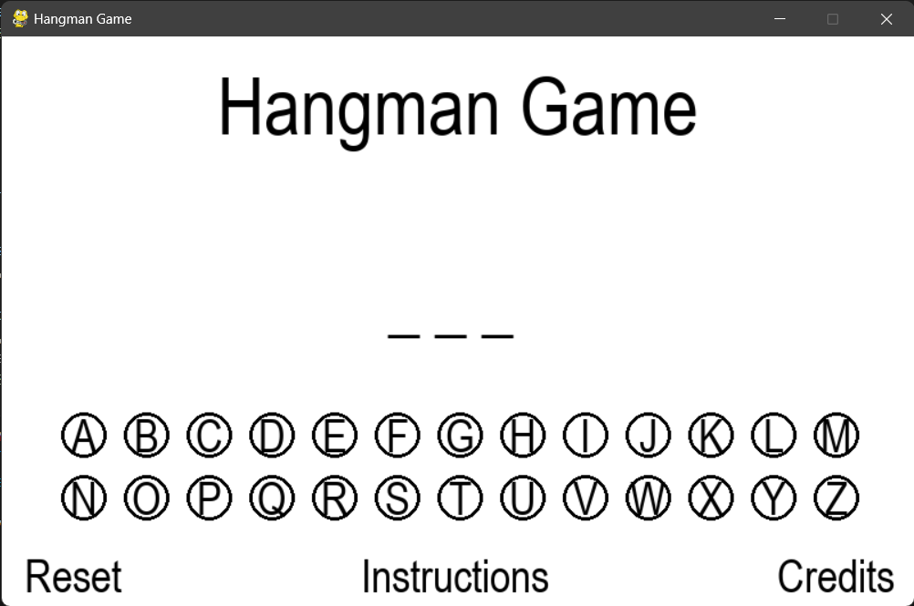

#  🕹️ Hangman-Game Project

Welcome to the official repository for the classic word guessing game, Hangman. This project is a modern take on the traditional game, offering a digital and interactive experience for players of all ages. Our aim is to provide endless entertainment while also serving as an educational tool to enhance vocabulary and spelling skills.


# Screenshots

Screenshot-1


Screenshot-2


# About the Game

In Hangman, players attempt to guess a hidden word by suggesting letters within a certain number of guesses. Each correct guess reveals the letter positions in the word, while incorrect guesses bring the player one step closer to being 'hanged'. The game ends when the player successfully guesses the word or runs out of attempts.

# Features
Vast Word Library: Enjoy a large collection of words from various categories and languages.

Learning Mode: Improve your vocabulary with definitions and usage examples after each round.

Animations: On Every Wrong Input the Animation of the Hangman is played in order until the last wrong letter is typed in and on winning it shows the animation being reversed and displaying You Won! in the end.

# Deployment

To deploy this project you need Pygame installed in your local pc 

To install pygame you need to type the command below in the
terminal

```bash
  pip install pygame
```

And simply open the folder in VSCode and run it.

Or you can use replit and upload all the files there and run the code. Replit has pygame library built into it.

# Team

Product Manager: [Arshdeep Singh](https://github.com/arshdeep4450) (2310991792)

Developer And Tester: [Arshit Kataria](https://github.com/arshitkataria2) (2310991793)
# Acknowledgements

Special thanks to [Dr. Vibhu Sharma](https://github.com/Vibs-11) for guiding us through this project and also deepened our understanding of Source Code Management


## Thank You 😊

Thank you for visiting our repository. Dive in and enjoy the game!
